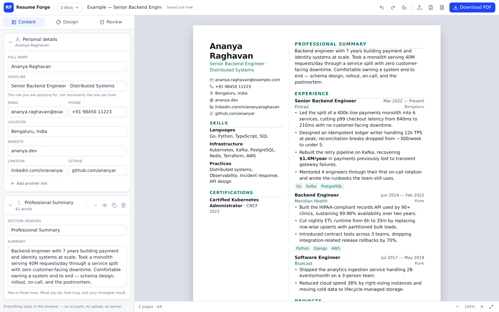

# Resume Forge

A résumé builder that runs entirely in your browser. Type on the left, watch a
real A4 or US-Letter page render on the right, and export a PDF whose text a
parser can actually read.

No account, no upload, no server. Your résumé lives in `localStorage` and in the
JSON files you choose to export.



## Why this one

Most builders lock the layout, trap your content behind a login, or export a PDF
that is secretly an image. Resume Forge is built around three ideas:

- **The preview is the document.** The page is sized in real millimetres and
  printed by the browser's own engine, so what you see is what a recruiter opens.
  The exported PDF contains selectable, machine-readable text — not a screenshot.
- **Your data is yours.** Everything stays on your device. Export the whole
  résumé as JSON at any time and re-import it anywhere.
- **Advice, not just fields.** The Review panel checks the things screeners
  actually look for and tells you *why*, in plain language.

## Features

**Writing**
- Sections for summary, experience, education, projects, skills, certifications,
  awards, publications, volunteering, languages, interests, plus custom sections
- Drag to reorder sections, entries and individual bullets
- Enter opens the next bullet, Backspace on an empty one removes it
- `**bold**` and `*italic*` inline, nothing heavier — heavy markup is what breaks
  résumé parsers
- Hide any section or entry without deleting it, so one résumé can be trimmed
  for a specific application
- Multiple résumés side by side, with duplicate for tailoring a variant
- Undo/redo (⌘Z / ⇧⌘Z) and autosave
- Reorder by dragging, or with arrow buttons that also work on touch and by
  keyboard

**Design**
- Five templates: Classic, Modern, Compact, Elegant, Technical
- Accent and text colour, heading and body fonts, font size, line height,
  section spacing, page margin, header alignment, bullet character
- A4 or US Letter, with page-break guides drawn where the page will actually break
- Only system-resident fonts, so the PDF renders the same on every machine
- Light and dark editor; the page itself always stays paper-white
- Works on a phone: the editor and the page take turns behind an Edit/Preview
  switch, and the page re-fits when you rotate

**Review**
- A 0–100 score with every deduction explained
- Bullet analysis: how many are quantified, how many open with a strong verb,
  which are too long, which start with "Responsible for"
- Flags first-person pronouns, filler phrases, repeated verbs, missing contact
  details, undated roles, and sections you left empty
- Paste a job description to see which of its terms your résumé already covers —
  keyword extraction that ignores boilerplate and prefers real phrases

**Export**
- PDF via the browser's print dialog (⌘P), with the filename pre-filled
- JSON for backup and re-import
- Plain text for the online application forms that mangle pasted formatting

## Running it

```bash
npm install
npm run dev          # http://localhost:5173
```

Build and serve the production bundle:

```bash
npm run build
npm run preview      # http://localhost:4173
```

The build is fully static — `dist/` can be dropped on any static host, or opened
from the filesystem.

### Checks

```bash
npm run typecheck    # TypeScript, strict
npm run smoke        # end-to-end checks against a running preview
```

The smoke test needs a Playwright Chromium (`npx playwright install chromium`),
or set `CHROMIUM_PATH` to a browser you already have.

## Publishing it

The build is a static bundle with relative asset paths, so it works from any
host and from any sub-path.

**GitHub Pages** is wired up already — `.github/workflows/deploy.yml` builds and
deploys on every push to `main`. One-time setup:

1. **Settings → Pages → Build and deployment → Source: GitHub Actions.**
   This step needs a human once: the workflow asks the API to create the Pages
   site itself, but `GITHUB_TOKEN` can deploy to an existing site without being
   able to create one, so the first run fails with *Resource not accessible by
   integration* until the toggle is flipped.
2. Push to `main`, or run *Deploy to GitHub Pages* manually from the **Actions**
   tab to publish a branch that hasn't been merged yet.

The site lands at `https://<user>.github.io/<repo>/`. If you fork or rename,
update the two absolute URLs in `index.html` — the `og:image` and `og:url` meta
tags, which link previews can't resolve from a relative path.

**Anywhere else** — Netlify, Vercel, Cloudflare Pages, S3, or a plain nginx
directory: build command `npm run build`, publish directory `dist`. There is no
server side, no environment variables and no runtime configuration.

## Exporting a good PDF

Press **Download PDF** (or ⌘P) and, in the print dialog:

- Destination: *Save as PDF*
- Margins: *None* — the page already carries the margin you set in Design
- **Background graphics: on** — otherwise tinted headings and the Modern sidebar
  print white

## How it is put together

```
src/
  lib/          data model, schema validation, formatting, review engine
  state/        store (subscription + undo/redo + autosave), mutation actions
  templates/    the five résumé layouts and their shared section renderers
  components/   editor panels, preview, print portal
```

A few decisions worth knowing about:

- **`ResumeDocument` renders twice.** Once on screen inside the zoomable
  preview, and once into a hidden `#print-root` portal outside the React root.
  Printing hides `#root` and lays out only the portal, so the browser paginates
  real text with no extra window and no PDF library.
- **Section content is rendered in one place.** `templates/parts.tsx` owns every
  section kind's body; each template only supplies the heading and the frame.
  Adding a section kind updates all five templates at once.
- **Everything that reaches the store is normalised.** `lib/schema.ts` accepts
  arbitrary JSON and returns a valid `Resume`, so a hand-edited export or an old
  saved document can't break the app.
- **Emptiness is content-aware.** A section you started but never filled in is
  skipped when the page renders, rather than leaving a bare heading behind.

## Accessibility

Audited with axe-core (WCAG 2.1 A and AA) across the Content, Design and Review
panels, in light and dark, on desktop and mobile — currently zero violations.
Every reorder affordance has a keyboard- and touch-operable equivalent, so
nothing depends on drag-and-drop.

## Limits

- The review encodes common résumé-screening conventions. It is a second pair of
  eyes, not a guarantee about any particular employer's system.
- `localStorage` is per-browser and per-device. Export the JSON if you care about
  the file. If the app ever crashes, the error screen hands your saved data back
  as a download before offering to clear it.
- Print output is verified in Chromium. Firefox and Safari use the same standard
  print CSS, but their pagination differs slightly — check your PDF before you
  send it.

## Licence

MIT
